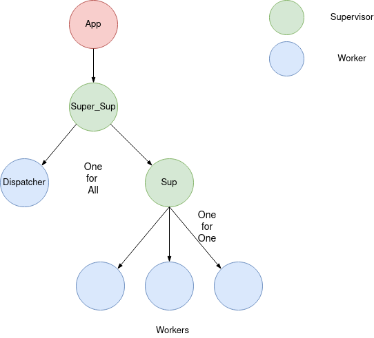
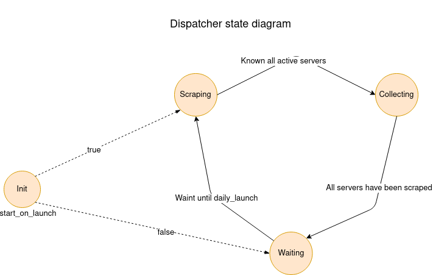

Travian Collector
=====

This is an application for scraping the map.sql info published by every Travian server at the morning.

It aims to be fast and robust as possible, so it use the benefits which the Erlang Virtual machine is made for, concurrency and fault tolerance.

How to use it
-------------
A release in erlang is self-contained so is easy to get ready:

1º Download the lastest release and unzip it

2º Edit the travian_collector/releases/release_version/sys.config file and changes the default variable to adjust the application(at least the tdir var)

3º And just launch the release and get child;)

    $ ./travian_collector/bin/travian_collector foreground

It launch a shell script which launch the release, the foreground option send the errors to stdout

How to edit the config file
---------------------------
Open sys.config file under travian_collector/releases/release_version/

This is a possible configuration example:

```
[{tc, [
    {maxTries, 6},
	{maxWorkers, 200},
	{daily_launch, #{hour => 9, minute => 0, second => 0}},
	{start_on_launch, true},
	{tdir, "/home/jorge/travian_root"}
]}].
```
#### maxTries
This is the maximum number of attempts until the app surrender at downloading a failure server
#### maxWorkers
The maximum number of parallel process working at the same time. Numbers higher 150 will have the same results
#### daily_launch
Self-explained, the time you want that the application starts to collect servers
#### start_on_launch
If you want to collect when the application starts, set as true, otherwise, set as false and wait until daily_launch
#### tdir
This is the directory where your collected servers will be saved, remember to have permission for writing&reading

What will come in the future
----------------------------
1º Make a Docker image

2º Getting more information than just the map.sql, for example the map size or the first day of the server

3º Writing the files to a json instead of a csv

4º Maybe a behaviour...


How it works
-----------


As every erlang/OTP app, it has a supervision tree. The supervisors look at the workers process an ensure if any of them crash, it is restart. On the other hand, the workers do the dirty job, in this case
the dispatcher acts as an orchestra director, sending task to the musicias (the workers in the image) and ensuring they do their job.



The dispatcher is a finite state machine which rotate between 3 three different states. In the scraping state, it grab the information about the current travian servers and then, switch to the collecting state.
In the collecting state, it sends the task to different process and manage the possible crashed servers. When all the tasks are done, it swaps to the waiting state, in which it sleep until the daily launch.

Issues and errors
-----------------
Open an issues or/and send me an email, sirwerto@gmail.com
